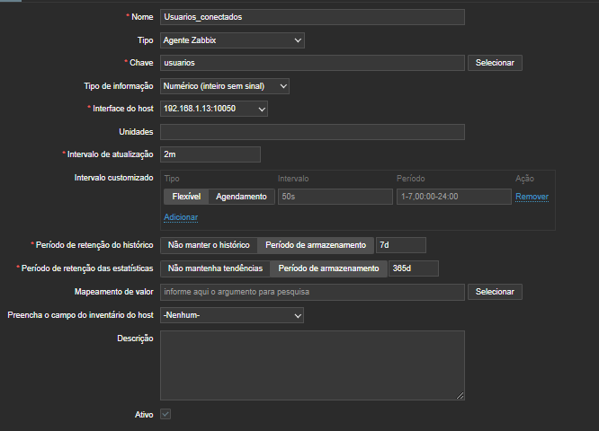
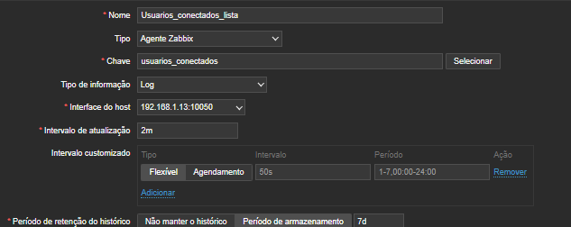
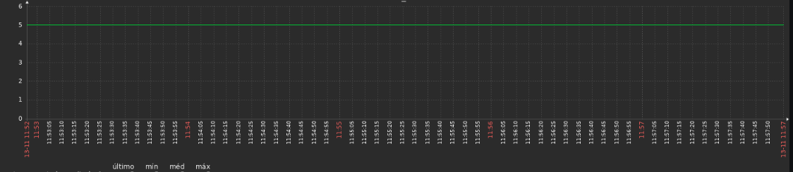
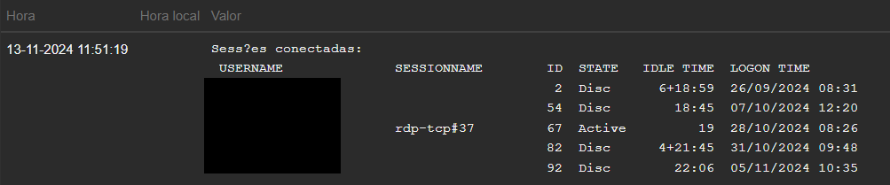

**Coletando informações de usuários logados no Windows Server através do PowerShell e enviando para o Zabbix**

Este script foi criado para ajudar no controle de acesso ao servidor, facilitando a coleta de métricas e a integração dessas métricas em dashboards.

O método consiste em dois scripts: um para a coleta de logs de usuários conectados e outro para o número de usuários online.

1° - Scripts:

usuarios.ps1
```
# Script para contar o número de usuários conectados

# Obtém as sessões ativas de usuários conectados
$sessions = query user

# Remove a linha do cabeçalho e linhas vazias
$connectedUsers = $sessions | Where-Object { $_ -and $_ -notmatch 'USERNAME' }

# Conta o número de usuários conectados
$userCount = $connectedUsers.Count

# Exibe o número de usuários conectados
Write-Host $userCount
```
usuarios_conectados.ps1

```
# Executa o comando quser para listar todas as sessões de usuários conectadas

$sessions = quser

# Verifica se há sessões ativas
if ($sessions) {
    Write-Host "Sessões conectadas:"
    $sessions | ForEach-Object { Write-Host $_ }
} else {
    Write-Host "Nenhuma sessão conectada."
}
```

2º - Salve os 2 Scripts em alguma pasta do seu servidor.

3° - Abra o arquivo do agent em C:\Program Files\Zabbix Agent 2\zabbix_agent2.conf

Adicione os UsersParameter apontando para os scripts.

```
UserParameter=usuarios,powershell -ExecutionPolicy Bypass -File "C:\caminho\usuarios.ps1"


UserParameter=usuarios_conectados,powershell -ExecutionPolicy Bypass -File "C:\caminho\usuarios_conectados.ps1"
```

4º - Reinicie o agent do Zabbix.

5º - No front do Zabbix, crie os itens no Host.

**OBS:** A chave do item deve ser a mesma dada em *UserParameter="chave"*.

**usuarios_conectados**

chave: usuario

tipo: Agente Zabbix

tipo de informação: numérico


**usuarios_conectados_lista**

chave: usuario_conectados

tipo: Agente Zabbix

tipo de informação: log



Aguarde o time da coleta e visualize os Dados Recentes para visualizar as informações.



